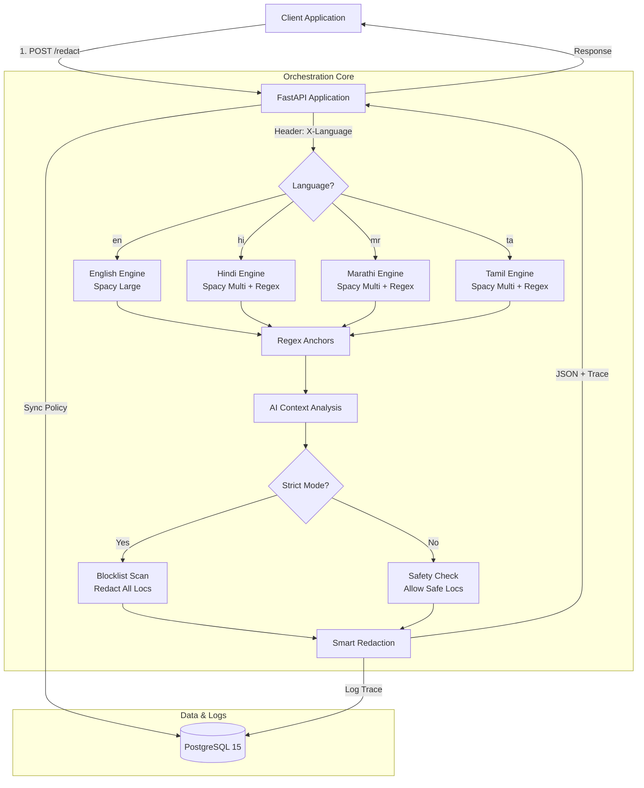

# 📘 AI4I PII Guardrail (v0.4 Quad-Lingual & Context)

**Technical Handover & System Architecture Documentation**

## 1. Project Overview

The **AI4I PII Guardrail** is a microservice designed to act as a privacy firewall. It sits between client applications and downstream services, intercepting unstructured text to identify and redact Personally Identifiable Information (PII) in real-time.

**v0.4 Update Highlights:**
* **Quad-Engine Intelligence:** Now supports **English (`en`)**, **Hindi (`hi`)**, **Marathi (`mr`)**, and **Tamil (`ta`)** via a unified detection architecture.
* **Context-Aware Strict Mode:** Implements a "User vs. Storage" logic. "User Mode" allows safe geographical terms (e.g., *Hoskote*, *Chennai*) for chat utility, while "Storage Mode" forcibly redacts them for zero-trust compliance.
* **Smart Redaction:** Features email-aware masking (`j**@gmail.com`), phone hashing (HMAC), and demographic risk escalation (e.g., *Farmer* + *Location* = High Risk).
* **Live Orchestration Trace:** Provides millisecond-accurate activity logs for "Fail-Closed" observability.

---

## 2. System Architecture

### 2.1 High-Level Component Diagram

The system features a branching logic flow based on Language and Target context.



### 2.2 Key Directories

* `models/`: Stores local Spacy vectors (`en_core_web_lg`, `xx_ent_wiki_sm`) and optional LLM weights.
* `main.py`: Core logic containing the `DetectionEngine` (Quad-Language), `AuditLogger`, and API routes.
* `init.sql`: Database schema and seeded templates (includes `logistics_hindi`, `logistics_marathi`, `logistics_tamil`).
* `index.html`: Admin Console & Playground with "Waterfall" Trace UI and auto-language detection.

---

## 3. Database Schema & Policies

### 3.1 Schema Design ("Clean Slate")

The system uses a **"Select-to-Deploy"** philosophy.

* **Table:** `domain_policies`
* **Default State:** `is_active = FALSE`.

| Column | Description |
| --- | --- |
| `domain_id` | Unique identifier (e.g., `demo_all`, `logistics_tamil`). |
| `policy_json` | JSON blob storing the active rule configuration. |
| `is_active` | Boolean flag. Controlled via the `/admin/deploy` endpoint. |

### 3.2 Available Templates (v0.4)

1. **`demo_all` (Super Domain):** Activates ALL capabilities across all languages.
2. **`logistics`:** Optimized for English addresses and phone numbers.
3. **`logistics_hindi`:** Specialized for Devanagari addresses (e.g., "टावर सी", "मकान नंबर").
4. **`logistics_marathi`:** Specialized for Marathi addresses (e.g., "घर क्रमांक", "पेठ").
5. **`logistics_tamil`:** Specialized for Tamil addresses (e.g., "வீட்டு எண்", "சாலை").
6. **`finance`:** Banking focus (PAN, IFSC, Cards).

---

## 4. Logic & Algorithms

### 4.1 Quad-Engine Detection

* **English:** Uses a 500MB Large model for deep syntactic understanding of Western address formats.
* **Hindi / Marathi:** Uses a lightweight Multi-lingual model combined with Devanagari-specific Regex Layers to handle alphanumerics (e.g., "Tower C") and agglutinative suffixes.
* **Tamil:** Uses the Multi-lingual model with specialized Unicode Regex for Tamil script (U+0B80 block) and postposition logic (e.g., handling "-il" or "-idam" suffixes).

### 4.2 Strict Mode & Risk Escalation

* **Behavior:** Controlled via `X-Target` header.
* **User Mode:** Whitelists known "Safe Cities" (e.g., Bangalore, Mumbai, Chennai) to maintain conversation flow.
* **Storage Mode:** Inverts the logic—Safe Cities become a **Blocklist**.
* **Combination Risk:** If a Quasi-Identifier (e.g., "Farmer", "Doctor") is detected, the system automatically escalates "Safe" locations to "High Risk" to prevent re-identification.

### 4.3 The "Trace Protocol"

The backend constructs a `trace` JSON array attached to every response, visualizing the decision path (e.g., "Why was 'Mysore' redacted? -> Strict Mode Blocklist").

---

## 5. Deployment Guide

### 5.1 Installation

1. **Clone & Setup**:

```bash
git clone <repo_url>
cd PII_G

```

2. **Build & Run (Auto-Provisioning)**:
The Dockerfile handles multi-language model downloads automatically.

```bash
docker-compose up --build

```

### 5.2 Resetting the Database

To wipe old policies and load the new multi-lingual templates:

```bash
docker-compose down
docker volume rm pii_g_postgres_data
docker-compose up --build -d

```

---

## 6. API Documentation

### 6.1 Core Endpoint: `/redact`

**Headers:**

* `X-Language`: `en` (default), `hi`, `mr`, or `ta`.
* `X-Target`: `user` (allow safe terms) or `storage` (strict redaction).

**Request:**

```json
{
  "text": "Address is No. 47, Hosur Road, Koramangala, Bangalore.",
  "domain": "demo_all"
}

```

**Response:**

```json
{
  "redacted_text": "Address is [HOUSE], [LOC], [LOC], [LOC].",
  "trace": [
    {
      "step": "Anchors (en)",
      "status": "Success",
      "details": "Found 1 high-risk anchors."
    },
    {
      "step": "AI & Context (en)",
      "status": "Success",
      "details": "Applied actions to 4 segments."
    }
  ],
  "metadata": { "language": "en", "processing_time_ms": 12 }
}

```

### 6.2 Admin Endpoints

* `POST /admin/deploy`: Activates a domain template.
* `POST /admin/activate-domains`: Bulk activation for testing.
* `POST /admin/generate-regex`: AI-assisted regex generation.

---

## 7. Frontend Features

1. **Multi-Lingual Playground:** Auto-detects language based on domain name (e.g., `logistics_tamil` sets `X-Language: ta`).
2. **Trace Panel:** Visualizes the specific engine used for the request.
3. **Policy Manager:** Deploying `demo_all` instantly enables a full-spectrum test environment.

---

## 8. Troubleshooting

| Issue | Solution |
| --- | --- |
| **Tamil/Hindi text not redacted** | Ensure `X-Language` header (`hi`, `mr`, `ta`) is correct. Verify the corresponding domain (e.g., `logistics_tamil`) is active. |
| **"Safe" city redacted** | Check if `X-Target` is set to `storage`. Switch to `user` to allow safe terms. |
| **Garbled Output** | Ensure you are using the latest `main.py` which contains the entity deduplication fix. |

```

```