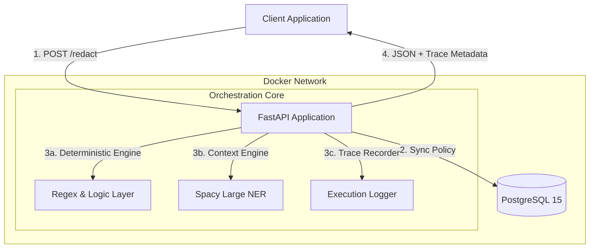

# 📘 AI4I PII Guardrail (v2.2 Enterprise Trace)

**Technical Handover & System Architecture Documentation**

## 1. Project Overview

The **AI4I PII Guardrail** is a microservice designed to act as a privacy firewall. It sits between client applications and downstream services, intercepting unstructured text to identify and redact Personally Identifiable Information (PII) in real-time.

**v2.2 Update Highlights:**
* **Live Orchestration Trace:** A real-time, millisecond-accurate activity log that visualizes the "Fail-Closed" decision process, providing complete observability.
* **Clean Slate Protocol:** All domains start inactive. Admins must explicitly "Configure & Deploy" policies, ensuring no default rules are applied without oversight.
* **Generic AI Mapping:** A zero-touch logic layer that automatically maps Spacy NER entities (like `PERSON`) to custom business rules (e.g., `CLIENT_NAME`, `WITNESS_NAME`) without code changes.

---

## 2. System Architecture

### 2.1 High-Level Component Diagram

The system is containerized using Docker Compose and consists of three primary services.



### 2.2 Key Directories

* `models/`: Stores the local `llama-3.2-3b-instruct.Q4_K_M.gguf` (optional) and Spacy vectors.
* `main.py`: Core logic containing the `DetectionEngine`, `PolicySyncAgent`, and Trace instrumentation.
* `init.sql`: Database schema (Default `is_active = FALSE`).
* `index.html`: Admin Console & Playground with "Waterfall" Trace UI.

---

## 3. Database Schema & Policies

### 3.1 Schema Design ("Clean Slate")

The system uses a **"Select-to-Deploy"** philosophy.

* **Table:** `domain_policies`
* **Default State:** `is_active = FALSE`. No domains are live on startup.

| Column | Description |
| --- | --- |
| `domain_id` | Unique identifier (e.g., 'finance', 'legal'). |
| `policy_json` | JSON blob storing the active rule configuration. |
| `is_active` | Boolean flag. Controlled via the `/admin/deploy` endpoint. |

### 3.2 Deployment Workflow

1. **Select Template:** Admin picks a domain (e.g., Education) from the sidebar.
2. **Configure Rules:** Admin toggles specific rules (e.g., enable `STUDENT_ID`, disable `EMAIL`) and adds custom regex rules.
3. **Deploy:** The system saves the specific configuration and sets `is_active = TRUE`.

---

## 4. Logic & Algorithms

### 4.1 Hybrid Detection Engine

1. **Deterministic Regex:**
* Runs first for high-speed pattern matching (e.g., IDs, Phones).
* **Builder:** Includes a mathematical regex generator for custom IDs.


2. **Generic AI Keyword Mapping (Smart Context):**
* **Problem:** Hardcoding `PERSON` -> `STUDENT_NAME` is not scalable.
* **Solution:** The system dynamically maps Spacy labels to active rules using keyword association.
* **Logic:** If Spacy finds a `PERSON` and an active rule contains "NAME", "CLIENT", "VICTIM", etc., it automatically links them.


### 4.2 The "Trace Protocol"

To prove "Fail-Closed" security without slowing down production, the system uses a **Post-Execution Trace**:

1. The backend measures execution time of every module (Auth, Sync, Regex, AI) in real-time.
2. It constructs a `trace` JSON array attached to the response.
3. The Frontend "replays" this trace visually to simulate the orchestration flow for auditors.

---

## 5. Deployment Guide

### 5.1 Installation (WSL/Linux)

1. **Clone & Setup**:
```bash
git clone <repo_url>
cd PII_G

```


2. **Install Model**:
Download `llama-3.2-3b-instruct.Q4_K_M.gguf` into the `models/` folder.
3. **Build & Run**:
```bash
docker-compose up --build

```


### 5.2 Resetting the Database

Since v2.2 uses persistent volumes, use this to trigger a "Fresh Install" (Clean Slate):

```bash
docker-compose down
docker volume rm pii_g_postgres_data
docker-compose up --build

```

---

## 6. API Documentation

### 6.1 Core Endpoint: `/redact`

Returns both the sanitized text and the execution trace.

**Response Structure:**

```json
{
  "redacted_text": "Student name is [REDACTED]...",
  "trace": [
    {
      "step": "Policy Synchronization",
      "status": "Success",
      "time_ms": 2,
      "details": "Loaded 4 active rules for domain 'education'."
    },
    {
      "step": "AI Context Engine",
      "status": "Success",
      "time_ms": 15,
      "details": "Spacy Large Model invoked. Mapped 1 entities."
    }
  ],
  "metadata": { "processing_time_ms": 22 }
}

```

### 6.2 Admin Endpoints

* `GET /admin/all-domains`: Lists all templates (active & inactive).
* `GET /admin/domain-config/{id}`: Fetches rule configuration for editing.
* `POST /admin/deploy`: **Critical.** Saves the selected rule subset and activates the domain.
* `POST /admin/generate-regex`: Uses logic to build regex from examples.

---

## 7. Frontend Features (v2.2)

The UI is divided into two panes:

1. **Playground (Live Audit):**
* **Trace Panel:** A right-hand "Activity Log" that animates the request lifecycle (Waterfall view).
* **Drill-Down:** Clicking a trace step reveals raw debug data (regex patterns matched, AI labels found).
* **Latency Badges:** Displays real backend processing time vs. animation time.


2. **Policy Manager:**
* **Checklist Interface:** Allows Admins to toggle specific rules within a domain.
* **Custom Rule Builder:** Integrated regex generator for adding bespoke entities.


---

## 8. Troubleshooting

| Issue | Solution |
| --- | --- |
| **Playground Dropdown Empty** | This is by design (Clean Slate). Go to **Policy Manager** and deploy a domain first. |
| **AI Not Detecting Names** | Ensure your custom rule name contains a keyword like "NAME", "PERSON", "CLIENT" so the Generic Mapper can find it. |
| **Masking leaves characters** | Fixed in v2.2. The system now correctly handles `visible_suffix_length: 0`. |

```

```